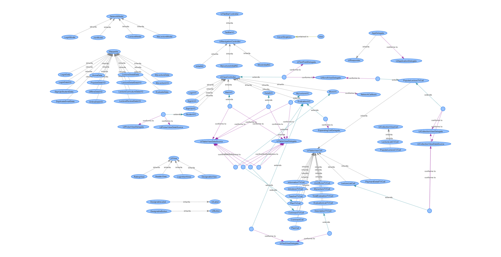

# # 청출어람 iOS 애플리케이션

블록체인 기반의 온/오프라인 귀농교육 애플리케이션


## # Languages, libraries and tools used

* Development Environment
	* Xcode 10
	* Swift
	* iOS 12
	* Klaytn Aspen Network

* Web3 Pods
	* [web3swift](https://github.com/BANKEX/web3swift)
	* [BigInt](https://github.com/attaswift/BigInt)

* Network Pods
	* [Alamofire](https://github.com/Alamofire/Alamofire)
	* [SwiftyJSON](https://github.com/SwiftyJSON/SwiftyJSON)
	* [ObjectMapper](https://github.com/tristanhimmelman/ObjectMapper)
	* [AlamofireObjectMapper](https://github.com/tristanhimmelman/AlamofireObjectMapper)

* UI Pods
	* [IQKeyboardManagerSwift](https://github.com/hackiftekhar/IQKeyboardManager)
	* [SDWebImage](https://github.com/SDWebImage/SDWebImage)
	* [lottie-ios](https://github.com/airbnb/lottie-ios)


## # Architecture

기본적으로 MVC (Model-View-Controller) 패턴을 사용합니다.
* View Controller를 재사용 할 수 없는 문제를 XIB를 이용해 CustomView 또는 Cell을 만들어 해결하였습니다.
* 재사용 가능한 모든 function은 Extension을 사용해 쉽게 유지보수가 가능하고, 기능 추가가 쉽도록 만들었습니다. 

### UML
***



## # Singleton

### Singleton을 사용한 이유
* web3 인스턴스가 쓰이는 뷰에 재사용 되어서 똑같이 기본 선언을 해주는 것이 바람직하지 않다고 생각했습니다.
* 한번 메모리에 올린 web3 인스턴스나 ABI, contract address, user address 그리고 App Sandbox 내부에 저장된 Keystore 파일들은 APP Life Cycle에서 값을 변경할 일이 없기 때문에 Singleton을 사용하는 것이 적절하다고 판단되었습니다.

### CaverSingleton 설명
* 기본적으로 Swift에서의 Singleton instance는 lazy하기 때문에 인스턴스를 생성하기 전까지 자원을 아낄수 있습니다. (로그인 시 인스턴스 생성)
* Instance 생성전에 CaverSingleton.setUserAddress(userAddress)를 선언함으로써 로그인 한 사용자의 Wallet Address를 Setup 합니다.
* private init()을 사용해 외부에서 값을 변경할 수 없기 때문에 thread-safe한 Singleton임을 보장합니다.
* keystoreMangaerInDevice()를 이용해 App Sandbox내에 생성된 Keystore 폴더를 호출하여 caver 객체에 바인딩 합니다. (Transaction, Sign을 바인딩한 Keystore에서 찾아 로컬에서 수행되기 때문)

```swift
import web3swift

final class CaverSingleton {
    
    static let sharedInstance: CaverSingleton = CaverSingleton()
    
    private init(){
        Web3.default = .init(provider: Web3HttpProvider.init(URL(string: "http://FullNodeIP:port")!)!)
        guard let setupUserAddress = CaverSingleton.user.address else {
            fatalError("Error - you must call setup before accessing CaverSingleton.sharedInstance")
        }
        userAddress = setupUserAddress
    }
    
    private class User {
        var address: Address?
    }
    
    private static let user = User()
    
    class func setUserAddress(_ userAddress: Address){
        CaverSingleton.user.address = userAddress
    }
    
    let caver: Web3 = Web3(url: URL(string: "http://FullNodeIP:port")!)!
    let contractAddress = Address("0x96a277b958988d9b4207dda53067fbd787b0e2db") // Deployed Contract Address
    let userAddress: Address
    
    func keystoreMangaerInDevice() -> KeystoreManager?{
        let userDir = NSSearchPathForDirectoriesInDomains(.documentDirectory, .userDomainMask, true)[0]
        let path = userDir+"/keystore"
        let keystoreManager =  KeystoreManager.managerForPath(path)
        return keystoreManager
    }

    let contractABI = "SKIP"
}
```

## # Unit Test

테스트용 Contract를 배포하여 Unit Test를 진행하였습니다. 

### Setup

Singleton을 사용했기 때문에 단위 테스트 시 userAddress를 Setup 해주어야 합니다.

```swift
    override func setUp() {
        CaverSingleton.setUserAddress(Address("0xf694888fc6eea44f8cd03e9c5f18af8f61bdebe8"))
    }
```

### Calculate Evaluation Average Point
***
Smart Contract의 calculateEvaluationAveragePoint를 호출하는 test case 입니다.

* iOS GCD 클래스의 Global Queue를 이용하여 UI를 처리하는 Main Thread에서 호출되지 않도록 했습니다.
* 단일 강의 평가점수 호출은 빠르나 실제 강의 목록에서 여러 강의의 점수를 불러오는 경우 UI Delay되는 현상이 발생하여 최초 로딩 시 한번에 호출하였습니다.
* [KlaytnExtenion.swift](https://github.com/ChungChoon/iOS/blob/master/ChungChul_iOS/Extensions/KlaytnExtention.swift)를 만들어 UIView에 extension 시켜 function을 활용하였습니다.

```swift
    func testCalculateEvaluationAveragePoint() {
        var value: Int?
        let lectureNumber: Int = 0
        DispatchQueue.global(qos: .utility).async {
            do {
                let contractAddress = CaverSingleton.sharedInstance.contractAddress
                value = try contractAddress.call("calculateEvaluationAveragePoint(uint256)", lectureNumber).wait().intCount()
                print(value!)
            } catch{
                print("Get Function Result Fail!")
                print(error.localizedDescription)
            }
        }
    }

   
```

### Get Klay Balances
***
보유 KLAY와 private key를 불러오는 test case 입니다.

```swift
    func testGetKlayBalances(){
        let caver = CaverSingleton.sharedInstance.caver
        let userAddress = CaverSingleton.sharedInstance.userAddress
        let keystore = CaverSingleton.sharedInstance.keystoreMangaerInDevice()
        var userKlay: BigUInt = 0
        var privateKey: Data?
        DispatchQueue.global(qos: .utility).async {
            do{
                userKlay = try caver.eth.getBalance(address: userAddress)
                privateKey = try keystore?.UNSAFE_getPrivateKeyData(password: "비밀번호", account: userAddress)
                print(userKlay)
                print(privateKey?.toHexString())
            }catch{
                print("Get Klay Balance Fail")
            }
        }
    }

    // Test Case '-[ChungChul_iOSTests.ChungChul_iOSTests testGetKlayBalances]' passed (0.224 seconds).
```

### Purchase Lecture
***
강의를 신청(구매)하는 Transaction test case 입니다.

```swift
    func testPurchaseLecture(){
        let instance = CaverSingleton.sharedInstance
        let caver = instance.caver
        let ABI = instance.contractABI
        let contractAddress = instance.contractAddress
        let passwd = "비밀번호"
        let lecturePrice = 10
        let lectureNumber = BigUInt(0)
        DispatchQueue.global(qos: .utility).async {
            do {
                // Option Setting
                var options = Web3Options.default
                options.value = Web3.Utils.parseToBigUInt("\(lecturePrice)", units: .eth)
                options.gasLimit = BigUInt(701431)
                options.from = CaverSingleton.sharedInstance.userAddress
                
                // Parameter Setting
                let lectureNumberParameter = [lectureNumber] as [AnyObject]
                
                // Estimated Gas
                let estimatedGas = try caver.contract(ABI, at: contractAddress).method("purchaseLecture", parameters: lectureNumberParameter, options: options).estimateGas(options: nil)
                options.gasLimit = estimatedGas
                
                // Transaction Setting
                let transactionResult = try caver.contract(ABI, at: contractAddress).method("purchaseLecture", parameters: lectureNumberParameter, options: options)
                
                // Transaction Send
                let sendingResult = try transactionResult.send(password: passwd)
                print(sendingResult.transaction)
            } catch{
                print("You don't have enough KLAY!")
                print(error.localizedDescription)
            }
        }
    }
```

### Evaluate Lecture
***
강의를 평가하는 Transaction test case 입니다.
* 블록에 기록된것이 보장된 후 Server와 통신하기 위해 global queue 안에서 결과를 받고 Main Thread에서 통신하였습니다.

```swift
    func testEvaluateLecture(){
        let instance = CaverSingleton.sharedInstance
        let caver = instance.caver
        let ABI = instance.contractABI
        let contractAddress = instance.contractAddress
        let passwd = "비밀번호"
        
        // Option Setting
        var options = Web3Options.default
        options.gasLimit = BigUInt(701431)
        options.from = instance.userAddress
        
        let lectureNumber = BigUInt(0)
        let preparationPoint = BigUInt(100)
        let contentPoint = BigUInt(80)
        let proceedPoint = BigUInt(34)
        let communicationPoint = BigUInt(77)
        let satisfactionPoint = BigUInt(99)
        
        // Parameter Setting
        let evaluateParameters = [lectureNumber, preparationPoint, contentPoint, proceedPoint, communicationPoint, satisfactionPoint] as [AnyObject]
        
        DispatchQueue.global(qos: .utility).async {
            do{
                // Estimated Gas
                let estimatedGas = try caver.contract(ABI, at: contractAddress).method("evaluateLecture", parameters: evaluateParameters, options: options).estimateGas(options: nil)
                options.gasLimit = estimatedGas

                // Transaction Setting
                let transactionResult = try caver.contract(ABI, at: contractAddress).method("evaluateLecture", parameters: evaluateParameters, options: options)

                // Transaction Send
                let sendingResult = try transactionResult.send(password: passwd)
                print(sendingResult.transaction)
                DispatchQueue.main.async {
                    // Request Network Logic to Server
                }
            } catch{
                print("You don't have enough KLAY!")
                print(error.localizedDescription)
            }
        }
    }
```